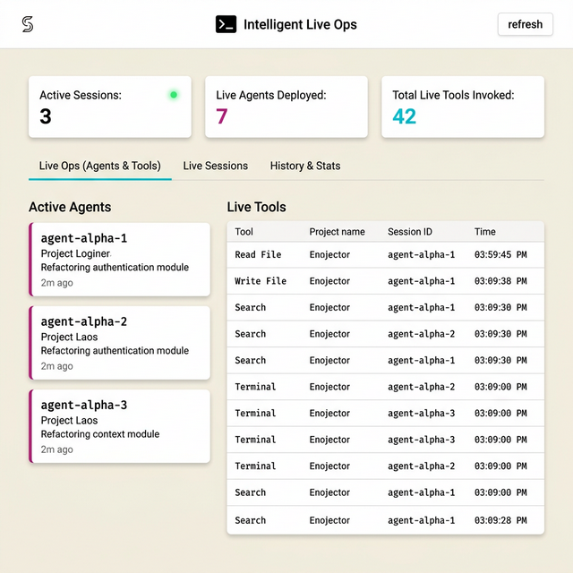

# Stourio CC Dashboard

Local observability dashboard for [Claude Code](https://docs.anthropic.com/en/docs/claude-code) sessions. Reads `~/.claude/projects/` session logs, parses them into structured data, and serves a real-time dashboard — **fully offline, never sends data anywhere**.

<p align="center">
  
</p>

---

<p align="center">
  
</p>

---

## Features

### 🟢 Live Ops
Real-time view of what Claude Code is doing right now — active agents with their tasks, and every tool invocation as it happens. Auto-refreshes every 30 seconds.

### 📡 Live Sessions
Table of all currently active sessions with project, model, duration, token usage, and tool call counts at a glance.

### 📊 History & Stats
- **Overview cards** — total tokens, events, tool calls, unique agents, and session counts across all history
- **Model distribution** — doughnut chart showing which models are used most
- **Activity heatmap** — GitHub-style 365-day heatmap of session activity

---

## Install

```bash
pip install .
```

## Run

```bash
# CLI command (opens browser automatically)
stourio-dashboard -o

# Or as a Python module
python -m stourio_dashboard
```

## CLI Options

```
-p, --port PORT    Port to listen on (default: 3000)
--host HOST        Host to bind to (default: 127.0.0.1)
-o, --open         Open browser on start
--version          Show version
```

---

## Run as Always-On Service (macOS)

Create a LaunchAgent to keep the dashboard running in the background:

```bash
cat << 'EOF' > ~/Library/LaunchAgents/com.stourio.dashboard.plist
<?xml version="1.0" encoding="UTF-8"?>
<!DOCTYPE plist PUBLIC "-//Apple//DTD PLIST 1.0//EN" "http://www.apple.com/DTDs/PropertyList-1.0.dtd">
<plist version="1.0">
<dict>
    <key>Label</key>
    <string>com.stourio.dashboard</string>
    <key>ProgramArguments</key>
    <array>
        <string>/Library/Frameworks/Python.framework/Versions/3.14/bin/stourio-dashboard</string>
        <string>-p</string>
        <string>3000</string>
    </array>
    <key>RunAtLoad</key>
    <true/>
    <key>KeepAlive</key>
    <true/>
    <key>StandardErrorPath</key>
    <string>/tmp/stourio-dashboard.err</string>
    <key>StandardOutPath</key>
    <string>/tmp/stourio-dashboard.out</string>
</dict>
</plist>
EOF

launchctl load ~/Library/LaunchAgents/com.stourio.dashboard.plist
launchctl start com.stourio.dashboard
```

### Manage the Service

```bash
# Stop the service
launchctl stop com.stourio.dashboard

# Unload (disable) the service
launchctl unload ~/Library/LaunchAgents/com.stourio.dashboard.plist

# Kill any orphaned processes
pkill -9 -f stourio_dashboard

# Reload after code changes
pip install .
launchctl unload ~/Library/LaunchAgents/com.stourio.dashboard.plist
launchctl load ~/Library/LaunchAgents/com.stourio.dashboard.plist
```

---

## Data

| Item | Path |
|---|---|
| Session logs (read-only) | `~/.claude/projects/**/*.jsonl` |
| Dashboard settings | `~/.stourio-dashboard/settings.json` |
| File cache | `~/.stourio-dashboard/cache/` |

The scanner uses **mtime-based cache invalidation** — unchanged files are never re-parsed. Active sessions are always re-evaluated to detect the 15-minute idle timeout.

### Delete All Session Data

```bash
find ~/.claude/projects -type f -name "*.jsonl" -delete
```

---

## API

| Endpoint | Method | Description |
|---|---|---|
| `/api/sessions` | `GET` | List sessions — supports `q`, `project`, `model`, `status`, `sort`, `limit`, `offset` |
| `/api/sessions/:id` | `GET` | Single session detail |
| `/api/sessions/:id/events` | `GET` | Raw parsed events for a session |
| `/api/stats` | `GET` | Aggregate stats: overview, live ops, daily/hourly breakdown, projects, agent teams |
| `/api/projects` | `GET` | Per-project metrics |
| `/api/settings` | `GET` | Dashboard settings + available models |
| `/api/settings` | `POST` | Update settings |
| `/api/health` | `GET` | Health check |

---

## Stack

- **Python 3.10+**
- **FastAPI** + **Uvicorn** — async HTTP server
- **Jinja2** — template rendering
- **orjson** — fast JSON parsing for `.jsonl` session files
- **Click** — CLI interface
- **httpx** — HTTP client
- **Tailwind CSS** (CDN) + **Chart.js** — frontend
- **Zero external database** — filesystem only

---

## Project Structure

```
stourio_dashboard/
├── app.py          # FastAPI routes and application setup
├── cli.py          # Click CLI entry point
├── config.py       # Paths, model pricing, context windows, settings
├── models.py       # Dataclasses (SessionSummary, TokenUsage, ToolCall, etc.)
├── parser.py       # JSONL session file parser
├── scanner.py      # File discovery, caching, stats aggregation
├── templates/
│   └── dashboard.html   # Single-page dashboard UI
└── static/
    ├── favicon.svg
    └── logo.png
```

---

## License

MIT
